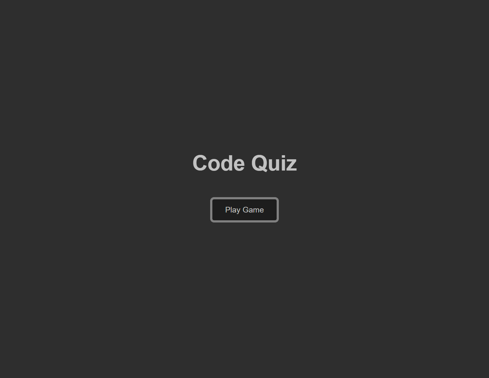
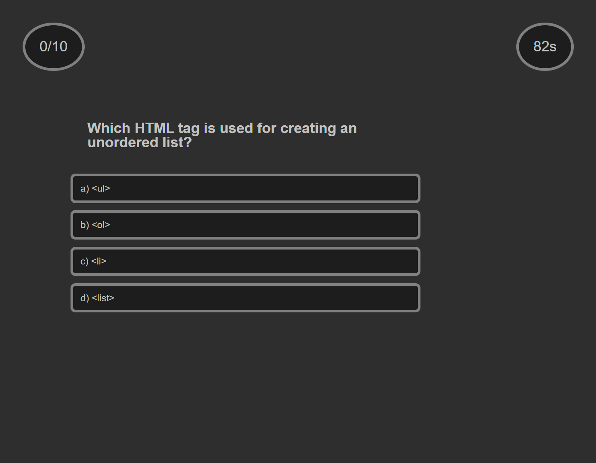
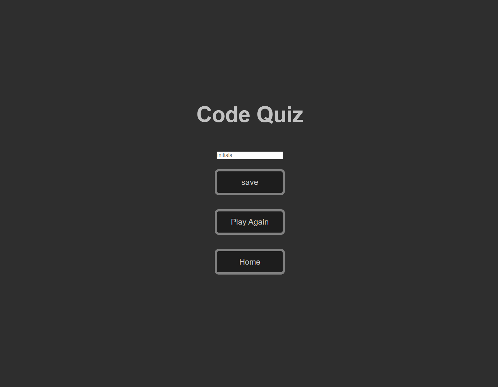

# Code-Quiz

## Table of Contents

- [About](#about)
- [Getting Started](#getting-started)
- [Usage](#usage)
- [Contributing](#contributing)
- [License](#license)

## About

Code-Quiz, as the name implies, is a short quiz I constructed. It is rather basic at the moment, but I intend to improve upon it by adding more features, functionality, and styling.

## Getting Started

N/A

## Usage

When playing the game, you will be timed and given a score. Upon reaching the end page (whether you finish answering all the questions or run out of time), you will be met with an end page where you will be asked to type your name. Your score will then be saved.

[Website Link](https://charleswt.github.io/Code-Quiz4/)

## Contributing

This project was developed by [Charles Tiffany](https://github.com/charleswt/).

## Screenshot

## License

Please refer to the [LICENSE](https://github.com/charleswt/Code-Quiz4/blob/main/LICENSE) file in the repository for details.
